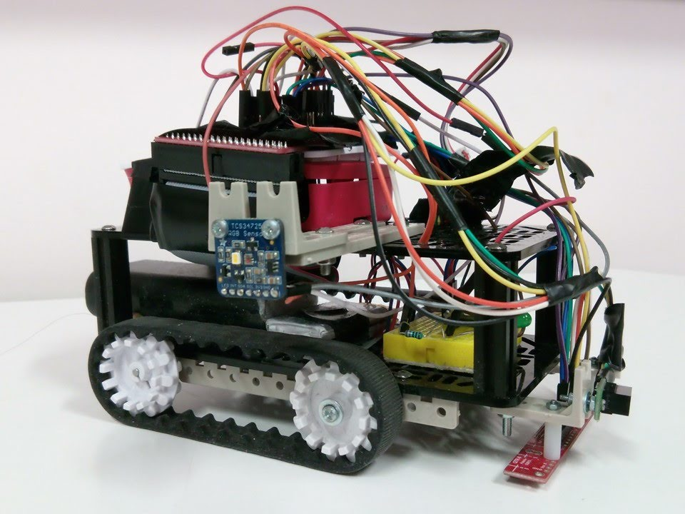

# My portfolio
Hello! My name is Joren Van Hecke and I am a computer engineering student. Here I present some of the projects I've worked on.
## Cluster

### In short
A product to extend the knowledge of any existing company chatbot by adding crowdsourcing capabilities using NLP tools. Cluster consists of a server, an NLP module, a moderator module and API libraries for communication between NLP, chatbot and server. I mainly worked on those libraries, `cluster-connector` for the NLP in Python and `ClusterClient` for a chatbot written in .NET (Core). I also contributed to the server and the chatbot that was built as a proof of concept. This team project was the subject of my bachelor's thesis and was commissioned by the company Realdolmen.
### Link
- [Landing page](https://heckej.github.io/P-O-Entrepreneurship-Team-A-ClusterConnector/)
- [GitHub repository](https://github.com/heckej/P-O-Entrepreneurship-Team-A-code)

## IVC Cage monitoring

  
  
  
  

### In short
For a team project in my second year as an undergraduate, we had to find a solution
to monitor a racks with IVC cages. Therefore, we designed a frame provided with
sensors to measure the food and water level. The sensors were connected to an
Arduino Nano which in turn could communicate with a Flask web app running on a
Raspberry Pi.
### Link
- [GitHub code repository](https://github.com/heckej/IVC-Monitoring)

## Line following car

## In Short
In my first of year as an undergraduate we had a team project in which we had
to build a self driving, line following car. We used a Raspberry Pi, an infrared
array sensor to detect straight and stop lines, an RGB sensor to try reading traffic lights and
a ultrasound sensor to detect cars in front of ours. The cross roads on the
demo track didn't have lines, so we implemented a feature to make the car believe
there were lines, so-called  _virtual lines_. This way we could easily reuse the
line following code. When no line could be found at the
other end of the cross road, a time based algorithm decided when to turn to the
most likely direction where the line could be. All of the coding was done in Python.
A UDP socket connection was established between the car and a computer, so
control could be taken over any time. Also, as an additional feature, we implemented
controls to drive the car using our computer keyboard arrows. Just plain fun!

* * *
~ Joren Van Hecke  
[@heckej](https://github.com/heckej/)  
[LinkedIn](https://www.linkedin.com/in/jorenvanhecke/)
